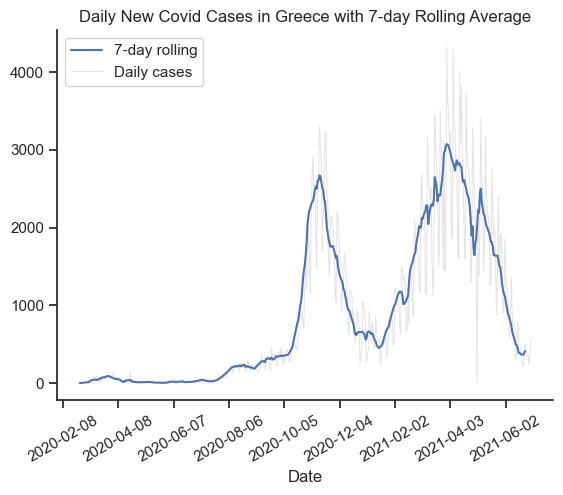

# Overview

This project was created out of a desire to analyze the Covid-19 cases of Greece more effectively. It delves into the 7-day rolling cases and forecast new cases to help understand the impact of Covid-19 in 2020 and 2021.
The data sourced from "husainaliarif/Covid19" provides a foundation for my analysis, containing detailed information on Covid-19 cases and locations. Through a series of Python scripts, I explore key questions such as the new cases of Covid-19, the monthly analysis and the forecasting of new cases in Greece.

# The Questions

Below are the questions I want to answer in my project:
1. How did daily new Covid-19 cases evolve in Greece?
2. What are the monthly trends of Covid-19 cases in Greece?
3. How accurate are forecasts of Covid-19 cases in Greece?

# Tools I Used

-Python: The backbone of my analysis, allowing me to analyze the data and find critical insights.I also used the following Python libraries:
    -Pandas Library: This was used to analyze the data.
    -Matplotlib Library: I visualized the data.
    -Seaborn Library: Helped me create more advanced visuals.
-Jupyter Notebooks: The tool I used to run my Python scripts which let me easily include my notes and analysis.
-Visual Studio Code: My go-to for executing my Python scripts.
-Git & GitHub: Essential for version control and sharing my Python code and analysis, ensuring collaboration and project tracking.

# Data Preparation and Cleanup

This section outlines the steps taken to prepare the data for analysis, ensuring accuracy and usability.

#### Import & Clean Up Data

I start by importing necessary libraries and loading the dataset, followed by initial data cleaning tasks to ensure data quality.

```python
# Importing Libraries
import pandas as pd
import seaborn as sns
import matplotlib.pyplot as plt
from datasets import load_dataset

# Loading Data
dataset = load_dataset("husainaliarif/Covid19")
df = dataset["train"].to_pandas()
```

### Filter Greece Cases

To focus my analysis on the Greek cases, I apply filters to the dataset, narrowing down to cases based in Greece.

```python
df_GR = df[(df["continent"] == "Europe") & (df["location"] == "Greece")]
```

# The Analysis

## 1. How did daily new Covid-19 cases evolve in Greece?

To find the new daily Covid-19 cases I calculated a seven-day rolling average and sorted the data by date. The resulting line plot shows the smoothed trend of new cases (7-day rolling average) compared to the raw daily cases, providing a clearer view of the overall trend over time.

View my notebook with detailed steps here:
[2_Rolling_Averages_and_Outlier_Handling.ipynb](Covid19_Analysis_and_Forecasting\2_Rolling_Averages_and_Outlier_Handling.ipynb)

### Visualize Data

```python
sns.lineplot(data=df_GR, x="date", y="cases_7d", label="7-day rolling")
sns.set_theme(style="ticks")
sns.despine()
plt.title("Daily New Covid Cases in Greece with 7-day Rolling Average")
plt.xlabel("Date")
plt.ylabel("")
plt.xticks(rotation=30)
plt.plot(df_GR["date"], df_GR["new_cases"], color='grey', linewidth=0.8, alpha=0.2, label="Daily cases")
ax = plt.gca()
ax.xaxis.set_major_locator(plt.MaxNLocator(10))
plt.legend()
plt.show()
```

### Results

 *Line plot visualizing the daily new cases with a seven-day rolling average and the raw daily cases*

### Insights

-Case counts in February and March 2020 remained at very low levels (below 200), suggesting a successful initial containment of the virus following the first restrictive measures.
-A gradual and significant increase in cases is observed starting in August 2020.This wave peaked around November 2020, with the 7-day rolling average reaching approximately 2,500-2,600 cases per day.This was followed by a drop and stabilization at levels higher than the initial phase, particularly during the Christmas period and early 2021.
-A new, more aggressive rise in cases began from late January/early February 2021.This wave was the most intense of the period covered by the graph, with the 7-day average exceeding 3,000 cases and daily cases (grey line) reaching or surpassing 4,000 cases.The peak occurred between March and April 2021.
-By June 2021, cases were on a significant downward trend, with the 7-day average approaching low levels again, though still visibly higher than the initial period of 2020.
-The blue line (7-day rolling average) smooths out the large daily variability (seen in the "noisy" grey line), making the trends and inflection points of the pandemic much clearer.

## 2. What are the monthly trends of Covid-19 cases in Greece?

To analyze seasonal patterns, I grouped the 7-day rolling average of new cases by month and calculated the monthly averages. The bar plot highlights the seasonal trends of Covid-19 in Greece, showing periods of high and low case numbers.

View my notebook with detailed steps here:
[3_Seasonal_Analysis_and_Time_Based_Trends.ipynb](Covid19_Analysis_and_Forecasting\3_Seasonal_Analysis_and_Time_Based_Trends.ipynb) 

### Visualize Data

```python
sns.barplot(data=monthly_avg_df, x="month", y="cases_7d")
sns.despine()
plt.title("Average Monthly Cases")
plt.xlabel("Month")
plt.ylabel("")
plt.show()
```

### Results


### Insights

-The highest intensity months, defined as those averaging over 1,000 daily cases, encapsulate the major waves. November stands out as the primary peak, recording the absolute highest average at approximately 2,150 cases, followed closely by December with an average of about 1,150 cases. The spring wave of 2021 is also evident in this category, with April peaking at around 1,400 cases, supported by consistently high averages in both February and March (ranging between 1,100 and 1,150 cases).
-A period of moderate intensity, marked by averages between 500 and 1,000 daily cases, typically serves as a transitional zone between the waves. October ($\approx 550$ cases) signals the distinct beginning of the seasonal surge after the summer. The post-peak decline is represented by January ($\approx 600$ cases) and May (just under 1,000 cases), where cases remain substantial but are visibly falling from their peaks.
-Τhe low intensity period, with averages below 500 daily cases, is dominated by the summer months. July records the absolute lowest average in the dataset, with approximately 50 cases. Interestingly, September ($\approx 280$ cases) is observed to have a lower average than June ($\approx 400$ cases), demonstrating that the summer lull extended well into the beginning of the autumn period, with August also remaining very low ($\approx 170$ cases).

## 3. How accurate are forecasts of Covid-19 cases in Greece?

To forecast Covid-19 cases, I applied a linear Exponential Smoothing model on the 7-day rolling average of past cases. The forecast was compared to the actual cases of the last month, showing that the predicted trend follows the real data fairly well.

View my notebook with detailed steps here:
[4_Forecasting_and_Model_Evaluation.ipynb](Covid19_Analysis_and_Forecasting\4_Forecasting_and_Model_Evaluation.ipynb)

### Visualize Data

```python
sns.lineplot(data=training_test, x="date", y="7d_cases", label="Past Months")
sns.despine()
sns.set_theme(style="ticks")
plt.xlabel("Date")
plt.ylabel("")
plt.xticks(rotation=30)
plt.plot(test_set.index, test_set["7d_cases"], color="grey", linewidth=1, alpha=0.5, label="Last Month")
plt.plot(forecast.index, forecast, color="red", linewidth=2, label="Forecast")
plt.legend()
plt.title("Covid Cases in Greece: Forecast vs Actual")
plt.show()
```

#### Results


#### Insights

-The blue line ("Past Months") depicts the overall course of the pandemic using the 7-day rolling average, recording two major waves: a peak around November 2020 ($\approx 2,700$ cases) and a second, larger wave peaking at over 3,000 cases in March/April 2021.
-The red line (Forecast), which is linear, predicted a slow and steady decline in cases (from $\approx 1,700$ to $\approx 1,200$). Conversely, the grey line (Actual Data) showed a non-linear, accelerating drop over the same timeframe, with cases falling much faster and further than the forecasted level.
-The linear forecasting model significantly overestimated the number of cases for the near future, as it failed to capture the dynamic of the rapid decrease (attributable to either interventions or the natural progression of the epidemic), which is confirmed by the actual drop being much steeper than the linear trend.


# What I Learned

Throughout this project, I deepened my understanding of time-series analysis and improved my technical skills in Python, especially in data cleaning, processing, and visualization. Here are a few specific things I learned:

-Advanced Python Usage: Working with Pandas for data manipulation and Seaborn/Matplotlib for visualizations helped me analyze real Covid-19 data efficiently and create clear, informative plots.
-Data Cleaning & Outlier Handling: I learned the importance of preprocessing steps such as applying rolling averages, removing outliers using z-scores, and preparing time-indexed datasets for reliable analysis.
-Time-Series Insights & Forecasting: Implementing techniques like seasonal grouping and Exponential Smoothing gave me hands-on experience in understanding trends over time and building short-term forecasts with measurable accuracy.

# Insights

Throughout this project, I significantly improved my data analysis skills and deepened my understanding of epidemiological data. Working with real Covid-19 case data helped me strengthen both my technical and analytical abilities. Here are a few key things I learned:

-Time-Series Analysis Techniques: I became comfortable applying rolling averages, detecting outliers with statistical methods, and preparing data for forecasting. These techniques allowed me to reveal underlying trends that daily case counts alone cannot show.
-Data Cleaning & Preparation: I learned how essential it is to clean and preprocess real-world datasets. Handling missing values, removing outliers, and structuring the data properly were crucial steps before producing any reliable visualization or forecast.
-Forecasting Fundamentals: By implementing Exponential Smoothing, I gained practical experience in time-series forecasting and evaluating model accuracy using metrics such as MAE, MSE, and MAPE.
-Effective Visualization: Through Seaborn and Matplotlib, I improved at designing clear and informative plots that communicate trends, seasonality, and differences between actual and predicted data.

# Challenges I Faced

This project presented several challenges that ultimately strengthened my analytical skills and improved my understanding of epidemiological data:

-Data Volatility & Noise: COVID-19 daily case counts in Greece fluctuate significantly, making it difficult to identify clear patterns. I had to carefully smooth the data using rolling averages while ensuring I did not distort the underlying trends.
-Choosing Appropriate Smoothing Windows: Determining whether a 7-day rolling average or the raw daily counts conveyed insights more accurately was not always straightforward. It required experimenting with different window sizes and comparing how each transformation affected the visibility of trends.
-Dealing with Missing or Irregular Entries: Real-world epidemiological data often contain gaps, irregular reporting days, or sudden spikes due to batch updates. Handling these inconsistencies was essential to avoid misleading conclusions.
-Balancing Detail With Interpretability: The dataset contained many potential metrics—daily cases, rolling averages, cumulative counts, etc. Deciding which indicators to highlight in the final analysis, without overwhelming the reader, required thoughtful planning.

# Conclusion

This exploration of COVID-19 case data in Greece has been highly insightful, revealing how statistical tools and visual analysis can uncover meaningful trends in complex real-world datasets. The patterns observed through rolling averages, monthly comparisons, and forecasting models strengthened my understanding of epidemiological data and demonstrated the importance of choosing the right analytical techniques. As public health data continues to evolve, ongoing analysis will remain essential for interpreting trends accurately. This project provides a solid foundation for future studies and highlights the value of continuous learning and refinement in data-driven research.
